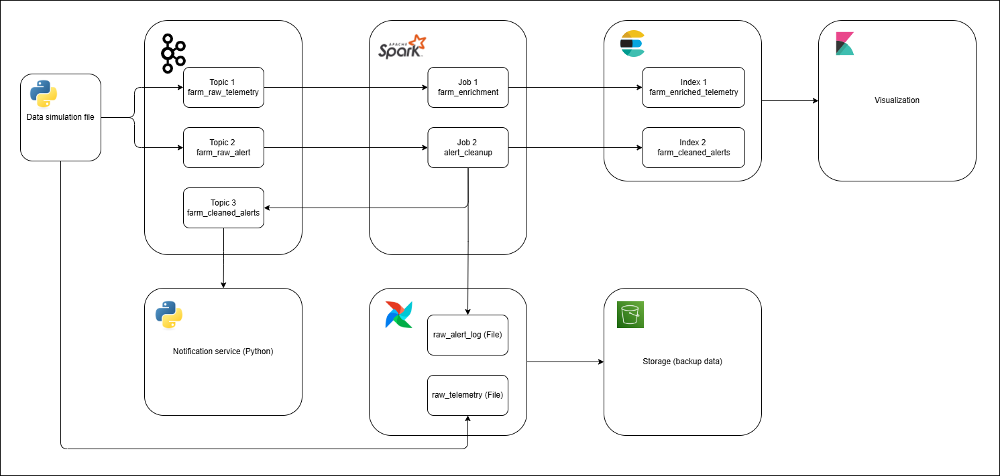

# SmartFarm IoT Big Data Pipeline
This project is a complete end-to-end IoT data processing pipeline designed for a SmartFarm environment.
It showcases real-time data ingestion, stream processing, alert handling, storage, and visualization using a modern big-data stack.
The pipeline includes:
- Python IoT Data Simulator
- Kafka (multi-broker support)
- Spark Structured Streaming (enrichment + alert cleaning jobs)
- Elasticsearch
- Kibana
- Airflow
- Notification Service
- Optional scaled deployment with multiple Kafka brokers, Spark workers, and Elasticsearch nodes



## How to Run the Project
Follow these instructions step-by-step.
### 1. Configure the Data Simulator
Edit the file: `data_simulator/config.yml`

### 2. Generate Metadata Database
Before starting the pipeline, generate metadata tables used by Spark processing.

Run **in this exact order**:
```bash
python3 generate_metadata/generate_locations.py
python3 generate_metadata/generate_alert_routes.py
```

### 3. Create data/ Folder (With Full Permissions)
Spark and other services write temporary files here.
```bash
mkdir data
chmod 777 data
```
This ensures all Docker containers can read/write/create files inside it.

### 4. Build and Start the Pipeline
- **Build images (no cache)**
```bash
docker compose -f docker-compose.yml build --no-cache
```
- **Start all services**
```bash
docker compose -f docker-compose.yml up -d
```
- To stop and remove everything (including volumes):
```bash
docker compose -f docker-compose.yml down -v
```

### 5. Running the Scaled Version (Multi-Broker, Multi-Worker)
- To run the fully scaled version with more Kafka brokers, Spark workers, and more Elasticsearch:
```bash
docker compose -f docker-compose.scaled.yml up -d
```
- Same to stop:
```bash
docker compose -f docker-compose.scaled.yml down -v
```
### 6. Enable Airflow Log Backup to S3
Add your S3 credentials to `.env`:
```bash
cat <<EOF >> .env
AWS_ACCESS_KEY_ID=<YOUR AWS ACCESS KEY ID>
AWS_SECRET_ACCESS_KEY=<YOUR AWS SECRET ACCESS KEY>
AWS_DEFAULT_REGION=<YOUR AWS DEFAULT REGION>
EOF
```
Airflow will automatically use these credentials when backing up logs to S3.

### 7. Verify the System Is Running
Open these URLs in your browser:
| **Component**             | **URL**|
|:--------------------------|:-----------------------|
| **Kafka Control Center**  | http://\<YOUR-IP>:9021 |
| **Spark Master UI**       | http://\<YOUR-IP>:8080 |
| **Elasticsearch Indices** | http://\<YOUR-IP>:9200/_cat/indices?v |
| **Kibana Dashboard** | http://\<YOUR-IP>:5601 |

### 8. Import Pre-Built Kibana Dashboard
A ready-to-use dashboard is provided at: `kibana/dashboards/smartfarm_kibana_dashboard_export.ndjson`

In Kibana:
- Go to **Stack Management** → **Saved Objects**
- Click **Import**
- Select the `.ndjson` file

### 9. Run the Data Simulator
The simulator sends IoT telemetry and alert messages to Kafka.
- **Run in Kafka mode**
```bash
python3 evaluation/test_es_index_speed.py
```
- **Available modes**

| **Mode** | **Description** |
|:---------|:----------------|
| `kafka` | Send all data to Kafka topics |
| `file` | Write output to local files instead of Kafka (for debugging, default mode) |

### 10. Test Performance & Latency
- **Test Elasticsearch indexing speed**
```bash
python3 evaluation/test_es_index_speed.py
```
- **Test end-to-end latency**
```bash
python3 evaluation/test_latency.py
```

### 11. Test Notification Service
Enter Notification Servkce container:
```bash
docker exec -it notification-service /bin/bash
```
Inside, you can inspect logs.